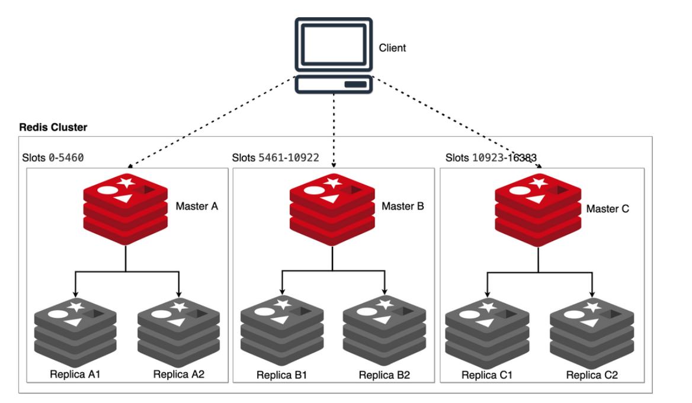

# Taller de Programación - Grupo X

**Consigna:**  [RustiDocs - 1C 25](https://taller-1-fiuba-rust.github.io/proyecto/25C1/proyecto.html)

Este proyecto implementa una aplicación de edición de documentos colaborativa y una base de datos tipo Redis Cluster, permitiendo almacenamiento distribuido, persistencia y operaciones concurrentes.

---

## Integrantes

- **Bercellini, Erika** - [erikabercellini](https://github.com/erikabercellini)
- **Bossi, Franco** - [FrancoBossi](https://github.com/FrancoBossi)
- **Campillay, Edgar Matías** - [EdCampi](https://github.com/EdCampi)
- **González Segura, Juan Manuel** - [undragonIII](https://github.com/undragonIII)

**Corrector:** Agustín Firmapaz

---

## ¿Cómo compilar?

### Compilación local
Desde la raíz del proyecto, ejecutar:

```sh
cargo build
```

### Compilación con Docker
```sh
docker build -t rustidocs-llm .
```

---

## ¿Cómo ejecutar?

### 🐳 **Ejecución con Docker**

#### Inicio rápido - Usar el sistema completo
```sh
# 1. Iniciar el cluster Redis completo con microservice
docker-compose up -d

# 2. Compilar la interfaz (solo la primera vez)
cargo build

# 3. Ejecutar la interfaz desde el host
./target/debug/interfaz

# 4. ¡Listo! Ahora puedes crear y editar documentos
```

#### Gestión del cluster
```sh
# Ver estado de todos los containers
docker-compose ps

# Ver logs del microservice en tiempo real
docker-compose logs microservice -f

# Ver logs de todos los servicios
docker-compose logs -f

# Detener el cluster
docker-compose stop

# Destruir completamente (incluye volúmenes)
docker-compose down -v
```

#### Servicios disponibles
- **Nodos Redis**: Puertos 7001-7009 (red interna Docker)
- **Microservice**: Ejecutándose en Docker con auto-detección de entorno
- **Interfaz**: Ejecutándose en host con detección automática de Docker

#### Características del sistema Docker:
- ✅ **Auto-detección de entorno**: La interfaz detecta automáticamente si se ejecuta con Docker
- ✅ **Comunicación cross-container**: Pub/Sub funciona entre host e interfaz Docker
- ✅ **Direccionamiento inteligente**: El sistema usa las IPs correctas según el contexto
- ✅ **Healthchecks**: Los containers esperan a que Redis esté listo antes de iniciar

### Ejecución local

#### Nodos de base de datos

##### Iniciar nodo:

```sh
cargo run --bin node <conf_file>
```

##### Unirse a un cluster existente:

```sh
cargo run --bin node <conf_file> <ip>:<port>
```

> Puedes crear tantos nodos como desees. Para cada nodo, debes crear previamente un archivo de configuración (ver carpeta `nodes/` para ejemplos). Para ejecutar el nodo, pasar ubicación del archivo de configuración del nodo y el puerto de un nodo preexistente en el cluster(siempre que no estemos ejecutando el primer nodo del clúster).

###### Levantar topología de 9 nodos

El cluster está diseñado para equilibrarse por cada nuevo nodo agregado al mismo,
de esa manera se puede conseguir automáticamente la topología propuesta por la
cátedra.

<div style="text-align: center;"></div>

```sh
cargo run --bin node ./utils/nodes/node_1/node_1.conf
```

```sh
cargo run --bin node ./utils/nodes/node_2/node_2.conf 127.0.0.1:7001
```

```sh
cargo run --bin node ./utils/nodes/node_3/node_3.conf 127.0.0.1:7002
```

```sh
cargo run --bin node ./utils/nodes/node_4/node_4.conf 127.0.0.1:7003
```

```sh
cargo run --bin node ./utils/nodes/node_5/node_5.conf 127.0.0.1:7004
```

```sh
cargo run --bin node ./utils/nodes/node_6/node_6.conf 127.0.0.1:7005
```

```sh
cargo run --bin node ./utils/nodes/node_7/node_7.conf 127.0.0.1:7006
```

```sh
cargo run --bin node ./utils/nodes/node_8/node_8.conf 127.0.0.1:7007
```

```sh
cargo run --bin node ./utils/nodes/node_9/node_9.conf 127.0.0.1:7008
```

#### Microservicio

Para lanzar el microservicio y permitir a los clientes la sincronización
es necesario correr el binario "microservice":

```sh
cargo run --bin microservice
```

NOTA: Por defecto se conecta al nodo 7001 de localhost, pero se puede cambiar en la línea 10 del binario.

#### Interfaz gráfica

Para lanzar la aplicación de edición de texto:

**Con Docker (recomendado):**
```sh
# 1. Asegúrate de que el cluster Docker esté ejecutándose
docker-compose up -d

# 2. Ejecuta la interfaz desde el host
./target/debug/interfaz
```

**Ejecución local (desarrollo):**
```sh
cargo run --bin interfaz <client_id>
```

NOTAS: 
- La interfaz detecta automáticamente si el microservice está en Docker o local
- Con Docker no necesitas especificar client_id (se genera automáticamente)
- Antes es necesario tener el microservice corriendo (ya sea en Docker o local)

Ejemplo para desarrollo local:

```sh
cargo run --bin interfaz 01
```

> Asegurarse de lanzar la interfaz gráfica una vez ya inicializado el microservice.

##### Simulación de clientes

Cada interfaz gráfica se conecta a un nodo y funciona como si fuera un cliente. Un mismo nodo puede recibir múltiples conexiones, lo que permite simular varios clientes simultáneamente.

En la entrega intermedia, la interacción entre nodos no estaba implementada. Ahora, sin embargo, el sistema permite que múltiples nodos se comuniquen correctamente entre sí. Por lo tanto, al ejecutar los binarios de nodos se demuestra el funcionamiento conjunto de todos los nodos del clúster.

---

## ¿Cómo correr los tests?

### Correr **todos** los tests (unitarios + integración)

```sh
cargo test
```

---

### Correr **solo los tests unitarios** (los que están dentro de los módulos del código fuente)

```sh
cargo test --lib
```

---

### Correr **solo los tests de integración** (los que están en la carpeta `tests/`)

```sh
cargo test --tests
```

O bien, para un archivo específico de integración:

```sh
cargo test --test command_integration_tests
```

Para correr un test específico de integración:

```sh
cargo test --test command_integration_tests nombre_del_test
```

---

## Notas

### Configuración Docker vs Local
- **Docker**: El sistema detecta automáticamente el entorno y configura las conexiones correctas
- **Local**: Requiere configuración manual de nodos y microservice

### Archivos importantes
- Los archivos de configuración de nodos se encuentran en la carpeta `utils/nodes/`
- Los logs y archivos de persistencia se generan en la raíz del proyecto o en los directorios configurados
- El archivo `docker-compose.yml` define toda la infraestructura del cluster

### Troubleshooting
- Si la interfaz no puede conectar al microservice, verifica que `docker-compose ps` muestre todos los containers como "healthy"
- Para debug, usa `docker-compose logs microservice -f` para ver los logs en tiempo real
- Para pruebas de cluster local, asegúrate de que los puertos y direcciones IP no estén en uso

### Funcionalidades implementadas
- ✅ **Cluster Redis distribuido** con 9 nodos
- ✅ **Persistencia automática** (AOF + snapshots)
- ✅ **Comunicación pub/sub** entre interfaz y microservice
- ✅ **Auto-detección de entorno** Docker vs host
- ✅ **Edición colaborativa** de documentos en tiempo real
- ✅ **Healthchecks** y gestión de dependencias en Docker
